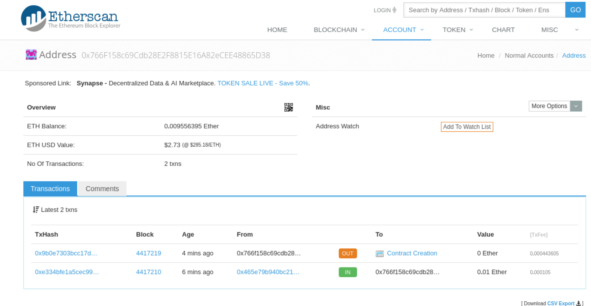

# Sample Session

```
> show ethJsonRpcUrl
show ethJsonRpcUrl
[info] https://mainnet.infura.io/xxxx
> ethKeystoreList
ethKeystoreList
+--------------------------------------------+
| Keystore Addresses                         |
+--------------------------------------------+
| 0x766f158c69cdb28e2f8815e16a82ecee48865d38 |
+--------------------------------------------+
[success] Total time: 0 s, completed Oct 23, 2017 3:55:28 PM
> ethBalance
ethBalance
[trace] Stack trace suppressed: run last compile:ethBalance for the full output.
[error] (compile:ethBalance) com.mchange.sc.v2.failable.package$UnhandledFailException: Fail: com.mchange.sc.v1.sbtethereum.package$SenderNotAvailableException: Cannot find an 'ethSender' or default sender (blockchain 'mainnet, configuration 'compile')'
[error] com.mchange.sc.v1.sbtethereum.SbtEthereumPlugin$autoImport$$anonfun$xethFindCurrentSenderTask$1$$anonfun$apply$104$$anonfun$apply$105.apply(SbtEthereumPlugin.scala:1375)
[error] com.mchange.sc.v1.sbtethereum.SbtEthereumPlugin$autoImport$$anonfun$xethFindCurrentSenderTask$1$$anonfun$apply$104$$anonfun$apply$105.apply(SbtEthereumPlugin.scala:1370)
[error] scala.Option.getOrElse(Option.scala:120)
[error] com.mchange.sc.v1.sbtethereum.SbtEthereumPlugin$autoImport$$anonfun$xethFindCurrentSenderTask$1$$anonfun$apply$104.apply(SbtEthereumPlugin.scala:1370)
[error] com.mchange.sc.v1.sbtethereum.SbtEthereumPlugin$autoImport$$anonfun$xethFindCurrentSenderTask$1$$anonfun$apply$104.apply(SbtEthereumPlugin.scala:1349)
[error] scala.util.Try$.apply(Try.scala:161)
[error] com.mchange.sc.v2.failable.package$Failable$.apply(package.scala:94)
[error] com.mchange.sc.v1.sbtethereum.SbtEthereumPlugin$autoImport$$anonfun$xethFindCurrentSenderTask$1.apply(SbtEthereumPlugin.scala:1349)
[error] com.mchange.sc.v1.sbtethereum.SbtEthereumPlugin$autoImport$$anonfun$xethFindCurrentSenderTask$1.apply(SbtEthereumPlugin.scala:1348)
[error] scala.Function1$$anonfun$compose$1.apply(Function1.scala:47)
[error] sbt.$tilde$greater$$anonfun$$u2219$1.apply(TypeFunctions.scala:40)
[error] sbt.std.Transform$$anon$4.work(System.scala:63)
[error] sbt.Execute$$anonfun$submit$1$$anonfun$apply$1.apply(Execute.scala:228)
[error] sbt.Execute$$anonfun$submit$1$$anonfun$apply$1.apply(Execute.scala:228)
[error] sbt.ErrorHandling$.wideConvert(ErrorHandling.scala:17)
[error] sbt.Execute.work(Execute.scala:237)
[error] sbt.Execute$$anonfun$submit$1.apply(Execute.scala:228)
[error] sbt.Execute$$anonfun$submit$1.apply(Execute.scala:228)
[error] sbt.ConcurrentRestrictions$$anon$4$$anonfun$1.apply(ConcurrentRestrictions.scala:159)
[error] sbt.CompletionService$$anon$2.call(CompletionService.scala:28)
[error] java.util.concurrent.FutureTask.run(FutureTask.java:266)
[error] java.util.concurrent.Executors$RunnableAdapter.call(Executors.java:511)
[error] java.util.concurrent.FutureTask.run(FutureTask.java:266)
[error] java.util.concurrent.ThreadPoolExecutor.runWorker(ThreadPoolExecutor.java:1149)
[error] java.util.concurrent.ThreadPoolExecutor$Worker.run(ThreadPoolExecutor.java:624)
[error] java.lang.Thread.run(Thread.java:748)
[error] Total time: 0 s, completed Oct 23, 2017 3:55:44 PM
> ethAliasSet defaultSender xxxxx
ethAliasSet defaultSender xxxxx
[info] Alias 'defaultSender' now points to address 'xxxx' (for blockchain 'mainnet').
[info] Refreshing alias cache.
[success] Total time: 0 s, completed Oct 23, 2017 3:56:47 PM
> ethBalance
ethBalance
[trace] Stack trace suppressed: run last compile:ethBalance for the full output.
[error] (compile:ethBalance) java.lang.NullPointerException
[error] Total time: 0 s, completed Oct 23, 2017 3:56:58 PM
> last compile:ethBalance
last compile:ethBalance
java.lang.NullPointerException
	at org.eclipse.jetty.io.ssl.SslClientConnectionFactory.newConnection(SslClientConnectionFactory.java:70)
	at org.eclipse.jetty.client.AbstractHttpClientTransport$ClientSelectorManager.newConnection(AbstractHttpClientTransport.java:191)
	at org.eclipse.jetty.io.ManagedSelector.createEndPoint(ManagedSelector.java:424)
	at org.eclipse.jetty.io.ManagedSelector.access$1600(ManagedSelector.java:61)
	at org.eclipse.jetty.io.ManagedSelector$CreateEndPoint.run(ManagedSelector.java:603)
	at org.eclipse.jetty.util.thread.Invocable.invokePreferred(Invocable.java:128)
	at org.eclipse.jetty.util.thread.Invocable$InvocableExecutor.invoke(Invocable.java:222)
	at org.eclipse.jetty.util.thread.strategy.EatWhatYouKill.doProduce(EatWhatYouKill.java:294)
	at org.eclipse.jetty.util.thread.strategy.EatWhatYouKill.run(EatWhatYouKill.java:199)
	at org.eclipse.jetty.util.thread.QueuedThreadPool.runJob(QueuedThreadPool.java:673)
	at org.eclipse.jetty.util.thread.QueuedThreadPool$2.run(QueuedThreadPool.java:591)
	at java.lang.Thread.run(Thread.java:748)
[error] (compile:ethBalance) java.lang.NullPointerException
> xethGasPriceOverrideSet 5 gwei
[info] Gas price override set to 5000000000.
[success] Total time: 0 s, completed Oct 23, 2017 4:22:20 PM
> ethDeployOnly SampleContract
[info] Unlocking address '0x766f158c69cdb28e2f8815e16a82ecee48865d38' (on blockchain 'mainnet', aliases 'defaultSender')
Enter passphrase or hex private key for address '0x766f158c69cdb28e2f8815e16a82ecee48865d38':
[info] V3 wallet found for '0x766f158c69cdb28e2f8815e16a82ecee48865d38' (aliases 'defaultSender')
[info] Contract 'SampleContract' deployed in transaction '0x9b0e7303bcc17d567ab74abc6c187625bc8fbafd31eb05a7d54ab2e17e50f12b'.
[info] Receipt for transaction '0x9b0e7303bcc17d567ab74abc6c187625bc8fbafd31eb05a7d54ab2e17e50f12b' not yet available, will try again in 15 seconds. Attempt 1/9.
[info] Receipt for transaction '0x9b0e7303bcc17d567ab74abc6c187625bc8fbafd31eb05a7d54ab2e17e50f12b' not yet available, will try again in 15 seconds. Attempt 2/9.
[info] Receipt for transaction '0x9b0e7303bcc17d567ab74abc6c187625bc8fbafd31eb05a7d54ab2e17e50f12b' not yet available, will try again in 15 seconds. Attempt 3/9.
[info] Receipt for transaction '0x9b0e7303bcc17d567ab74abc6c187625bc8fbafd31eb05a7d54ab2e17e50f12b' not yet available, will try again in 15 seconds. Attempt 4/9.
[info] Receipt for transaction '0x9b0e7303bcc17d567ab74abc6c187625bc8fbafd31eb05a7d54ab2e17e50f12b' not yet available, will try again in 15 seconds. Attempt 5/9.
[info] Receipt received for transaction '0x9b0e7303bcc17d567ab74abc6c187625bc8fbafd31eb05a7d54ab2e17e50f12b':
[info] Transaction Receipt:
[info]        Transaction Hash:    0x9b0e7303bcc17d567ab74abc6c187625bc8fbafd31eb05a7d54ab2e17e50f12b
[info]        Transaction Index:   23
[info]        Transaction Status:  SUCCEEDED
[info]        Block Hash:          0x05bab951924a1a7fadfd462da06bf2398c951e846a26fe228e6532b5b7857885
[info]        Block Number:        4417219
[info]        Cumulative Gas Used: 899747
[info]        Contract Address:    0x019e39e4c8c46034b1c0da2d26f99cc6a1ae941b
[info]        Logs:                None
[info] Contract 'SampleContract' has been assigned address '0x019e39e4c8c46034b1c0da2d26f99cc6a1ae941b'.
> ethCompilationsList
+------------+--------------------------------------------+----------------------+--------------------------------------------------------------------+------------------------------+
| Blockchain | Contract Address                           | Name                 | Code Hash                                                          | Deployment Timestamp         |
+------------+--------------------------------------------+----------------------+--------------------------------------------------------------------+------------------------------+
| mainnet    | 0x019e39e4c8c46034b1c0da2d26f99cc6a1ae941b | SampleContract       | 0xebd2941e2f46d0daf2dc625e6eef82a9354ef42bab83170088582010c571215c | 2017-10-23T16:24:13.017-0700 |
+------------+--------------------------------------------+----------------------+--------------------------------------------------------------------+------------------------------+
[success] Total time: 0 s, completed Oct 23, 2017 4:24:39 PM
> ethCompilationsInspect 0x019e39e4c8c46034b1c0da2d26f99cc6a1ae941b

-=-=-=-=-=-=-=-=-=-=-=-=-=-=-=-=-=-=-=-=-=-=-=-=-=-=-=-=-=-=-=-=-=-=-=-=
                       CONTRACT INFO DUMP
-=-=-=-=-=-=-=-=-=-=-=-=-=-=-=-=-=-=-=-=-=-=-=-=-=-=-=-=-=-=-=-=-=-=-=-=
------------------------------------------------------------------------
Contract Address (on blockchain 'mainnet'):

0x019e39e4c8c46034b1c0da2d26f99cc6a1ae941b
------------------------------------------------------------------------
Deployer Address:

0x766f158c69cdb28e2f8815e16a82ecee48865d38
------------------------------------------------------------------------
Transaction Hash:

0x9b0e7303bcc17d567ab74abc6c187625bc8fbafd31eb05a7d54ab2e17e50f12b
------------------------------------------------------------------------
Deployment Timestamp:

Mon Oct 23 16:24:13 PDT 2017
------------------------------------------------------------------------
Code Hash:

0xebd2941e2f46d0daf2dc625e6eef82a9354ef42bab83170088582010c571215c
------------------------------------------------------------------------
Code:

0x60606040523415600b57fe5b5b60878061001a6000396000f30060606040526000357c0100000000000000000000000000000000000000000000000000000000900463ffffffff168063c72852a714603a575bfe5b3415604157fe5b605560048080359060200190919050506057565b005b5b505600a165627a7a72305820eb4a6f473ca4af6929fcccdeb92a35bf08b24e9c204ee231ca94f5d2ae5cbf380029
------------------------------------------------------------------------
Contract Name:

SampleContract
------------------------------------------------------------------------
Contract Source:

/*
 * DO NOT EDIT! DO NOT EDIT! DO NOT EDIT!
 *
 * This is an automatically generated file. It will be overwritten.
 *
 * For the original source see
 *    '/mnt/_/work/experiments/ethereum/my-scala-solidity-project/src/main/solidity/SampleContract.sol'
 */

pragma solidity ^0.4.10;


contract SampleContract {
  function asdf (uint param) constant {}
}

------------------------------------------------------------------------
Contract Language:

Solidity
------------------------------------------------------------------------
Language Version:

0.4.10
------------------------------------------------------------------------
Compiler Version:

0.4.10+commit.f0d539ae
------------------------------------------------------------------------
Compiler Options:

{"compilationTarget":{"<stdin>":"SampleContract"},"libraries":{},"optimizer":{"enabled":false,"runs":200},"remappings":[]}
------------------------------------------------------------------------
ABI Definition:

[{"name":"asdf","inputs":[{"name":"param","type":"uint256"}],"outputs":[],"constant":true,"payable":false,"type":"function"}]
------------------------------------------------------------------------
Metadata:

{"compiler":{"version":"0.4.10+commit.f0d539ae"},"language":"Solidity","output":{"abi":[{"constant":true,"inputs":[{"name":"param","type":"uint256"}],"name":"asdf","outputs":[],"payable":false,"type":"function"}],"devdoc":{"methods":{}},"userdoc":{"methods":{}}},"settings":{"compilationTarget":{"<stdin>":"SampleContract"},"libraries":{},"optimizer":{"enabled":false,"runs":200},"remappings":[]},"sources":{"<stdin>":{"keccak256":"0x7c7952bfe078283b67b234e85015526fa747199a8f0f62d2de054040a7c22b1b","urls":["bzzr://41c7b78ea23f8ceb0193f5ae719719139e2b22c6dad0e7e0cdd7f61148e21566"]}},"version":1}
-=-=-=-=-=-=-=-=-=-=-=-=-=-=-=-=-=-=-=-=-=-=-=-=-=-=-=-=-=-=-=-=-=-=-=-=

[success] Total time: 0 s, completed Oct 23, 2017 4:25:21 PM
```

Go to https://etherscan.io/address/0x019e39e4c8c46034b1c0da2d26f99cc6a1ae941b

The query cost a tiny bit.

```
> ethBalance
[info] 0.009556395 ether (as of the latest incorporated block, address 0x766f158c69cdb28e2f8815e16a82ecee48865d38)
[success] Total time: 0 s, completed Oct 23, 2017 4:26:26 PM
> ethKeystoreList
+--------------------------------------------+
| Keystore Addresses                         |
+--------------------------------------------+
| 0x766f158c69cdb28e2f8815e16a82ecee48865d38 | <-- defaultSender
[success] Total time: 0 s, completed Oct 23, 2017 4:27:11 PM
```



```
> ethInvokeConstant 0x019e39e4c8c46034b1c0da2d26f99cc6a1ae941b asdf 1234
[info] Call data for function call: c72852a700000000000000000000000000000000000000000000000000000000000004d2
[info] Outputs of function are (  )
[info] Raw result of call to function 'asdf': 0x
[info] The function asdf yields no result.
[success] Total time: 0 s, completed Oct 23, 2017 4:29:14 PM
> ethInvokeTransaction 0x019e39e4c8c46034b1c0da2d26f99cc6a1ae941b asdf 1234
[info] Unlocking address '0x766f158c69cdb28e2f8815e16a82ecee48865d38' (on blockchain 'mainnet', aliases 'defaultSender')
Enter passphrase or hex private key for address '0x766f158c69cdb28e2f8815e16a82ecee48865d38':
[info] V3 wallet found for '0x766f158c69cdb28e2f8815e16a82ecee48865d38' (aliases 'defaultSender')
[info] Outputs of function are (  )
[info] Call data for function call: c72852a700000000000000000000000000000000000000000000000000000000000004d2
[info] Gas estimated for function call: 26006
[info] Gas price set to 5000000000 wei
[info] Estimated transaction cost 130030000000000 wei (0.00013003 ether).
[info] Called function 'asdf', with args '1234', sending 0 wei to address '0x019e39e4c8c46034b1c0da2d26f99cc6a1ae941b' in transaction '0x142b432babfd7d00dd97877e4f38e5743b849d71432d59abe658f88322979c5a'.
[info] Receipt for transaction '0x142b432babfd7d00dd97877e4f38e5743b849d71432d59abe658f88322979c5a' not yet available, will try again in 15 seconds. Attempt 1/9.
```
