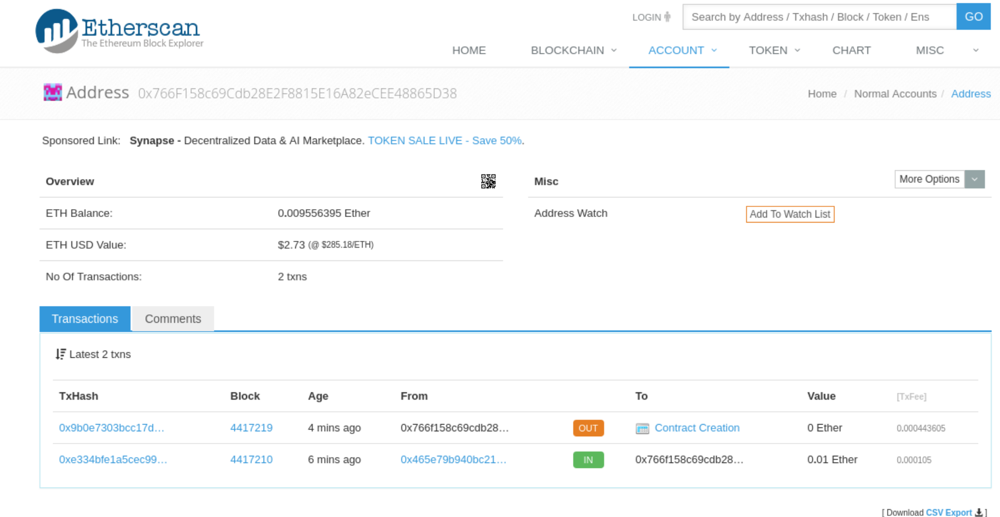

# `sbt-ethereum` SBT Tasks and Settings
The following SBT tasks and settings are provided by `sbt-ethereum`.
Some require configuration, others do not.

## `eth` Tasks and Settings

### `ethAbiForget`
This task removes an ABI definition that was added to the `sbt-ethereum` database via [ethAbiMemorize](#ethabimemorize).
Sample usage:
```sbtshell
> ethAbiForget 0x019e39e4c8c46034b1c0da2d26f99cc6a1ae941b
[info] Previously memorized ABI for contract with address '0x019e39e4c8c46034b1c0da2d26f99cc6a1ae941b' (on blockchain 'mainnet') has been forgotten.
[success] Total time: 0 s, completed Oct 24, 2017 5:04:53 PM
```

### `ethAbiList`
This task lists the addresses for which ABI definitions have been memorized. 
Does not include our own deployed compilations, see [ethCompilationsList](#ethcompilationslist).
Sample usage:
```sbtshell
> ethAbiList
+--------------------------------------------+
| Contracts with Memorized ABIs              |
+--------------------------------------------+
| 0x019e39e4c8c46034b1c0da2d26f99cc6a1ae941b |
| 0x1d0dcc8d8bcafa8e8502beaeef6cbd49d3affcdc | <-- gnosis-dutch-auction
| 0x314159265dd8dbb310642f98f50c066173c1259b | <-- ens
| 0x6090a6e47849629b7245dfa1ca21d94cd15878ef | <-- ens-resolver
| 0xcb94be6f13a1182e4a4b6140cb7bf2025d28e41b | <-- trustcoin
| 0xfa05a73ffe78ef8f1a739473e462c54bae6567d9 | <-- lunyr-crowdsale
+--------------------------------------------+
[success] Total time: 0 s, completed Oct 24, 2017 5:04:07 PM
```

### `ethAbiMemorize`
This task prompts for an ABI definition for a contract and inserts it into the `sbt-ethereum` database.
Sample usage:
```sbtshell
> ethAbiMemorize
Contract address in hex: 0x019e39e4c8c46034b1c0da2d26f99cc6a1ae941b
Contract ABI: [{"name":"asdf","inputs":[{"name":"param","type":"uint256"}],"outputs":[],"constant":true,"payable":false,"type":"function"}]
[info] ABI is now known for the contract at address 019e39e4c8c46034b1c0da2d26f99cc6a1ae941b
[success] Total time: 29 s, completed Oct 24, 2017 4:58:02 PM
```

### `ethAliasDrop`
This task drops an alias for an ethereum address from the `sbt-ethereum` repository database.
Sample usage:
```sbtshell
> ethAliasDrop asdfer
[info] Alias 'asdfer' successfully dropped (for blockchain 'mainnet').
[info] Refreshing alias cache.
[success] Total time: 0 s, completed Oct 24, 2017 5:01:23 PM

```

### `ethAliasList`
This task lists aliases for ethereum addresses that can be used in place of the hex address in many tasks.
Sample usage:
```sbtshell
> ethAliasList
altcoins -> 0xc0d2ec78e58e3a20cdd01bfde1d17c90ebc57a9c
asdfer -> 0x019e39e4c8c46034b1c0da2d26f99cc6a1ae941b
defaultSender -> 0x465e79b940bc2157e4259ff6b2d92f454497f1e4
ens -> 0x314159265dd8dbb310642f98f50c066173c1259b
ens-resolver -> 0x6090a6e47849629b7245dfa1ca21d94cd15878ef
gnosis-dutch-auction -> 0x1d0dcc8d8bcafa8e8502beaeef6cbd49d3affcdc
lunyr-crowdsale -> 0xfa05a73ffe78ef8f1a739473e462c54bae6567d9
steve-ens -> 0xf0ed4a1ade1f4bbcc875275a9480c387dcdb185c
trustcoin -> 0xcb94be6f13a1182e4a4b6140cb7bf2025d28e41b
[success] Total time: 0 s, completed Oct 24, 2017 5:00:18 PM
```

### `ethAliasSet`
This task defines or redefines an alias for an ethereum address that can be used in place of the hex address in many tasks.
Sample usage:
```sbtshell
> ethAliasSet asdfer 0x019e39e4c8c46034b1c0da2d26f99cc6a1ae941b
[info] Alias 'asdfer' now points to address '019e39e4c8c46034b1c0da2d26f99cc6a1ae941b' (for blockchain 'mainnet').
[info] Refreshing alias cache.
[success] Total time: 0 s, completed Oct 24, 2017 4:59:37 PM
```

### `ethBalance`
This task computes the balance in ether of a given address, or of current sender if no address is supplied.
The following sample usage shows a balance worth approximately $3 at the time of writing:
```sbtshell
> ethBalance
[info] 0.009448035 ether (as of the latest incorporated block, address 0x766f158c69cdb28e2f8815e16a82ecee48865d38)
[success] Total time: 0 s, completed Oct 24, 2017 5:02:36 PM

```

### `ethBalanceInWei`
This task computes the balance in wei of a given address, or of current sender if no address is supplied.
Sample usage:
```sbtshell
> ethBalanceInWei
[info] 9448035000000000 wei (as of the latest incorporated block, address 0x766f158c69cdb28e2f8815e16a82ecee48865d38)
[success] Total time: 0 s, completed Oct 24, 2017 5:02:22 PM
```

### `ethBlockchainId`
This setting defines the name for the network represented by [ethJsonRpcUrl](#ethjsonrpcurl), for example `mainnet`, `morden`, or `ropsten`.
Sample usage:
```tut
1 + 1
```

### `ethCompilationsCull`
This task removes never-deployed compilations from the repository database.
Sample usage:
```tut
1 + 1
```

### `ethCompilationsInspect`
This task dumps to the console full information about a compilation, based on either a code hash or contract address.

[etherscan.io](https://etherscan.io) can show the same information; the information provided in the following 
code example for the contract at address `0x019e39e4c8c46034b1c0da2d26f99cc6a1ae941` is also available at
[https://etherscan.io/address/0x019e39e4c8c46034b1c0da2d26f99cc6a1ae941b](https://etherscan.io/address/0x019e39e4c8c46034b1c0da2d26f99cc6a1ae941b).



```sbtshell
> ethCompilationsInspect 0x019e39e4c8c46034b1c0da2d26f99cc6a1ae941b

-=-=-=-=-=-=-=-=-=-=-=-=-=-=-=-=-=-=-=-=-=-=-=-=-=-=-=-=-=-=-=-=-=-=-=-=
                       CONTRACT INFO DUMP
-=-=-=-=-=-=-=-=-=-=-=-=-=-=-=-=-=-=-=-=-=-=-=-=-=-=-=-=-=-=-=-=-=-=-=-=
------------------------------------------------------------------------
Contract Address (on blockchain 'mainnet'):

0x019e39e4c8c46034b1c0da2d26f99cc6a1ae941b
------------------------------------------------------------------------
Deployer Address:

0x766f158c69cdb28e2f8815e16a82ecee48865d38
------------------------------------------------------------------------
Transaction Hash:

0x9b0e7303bcc17d567ab74abc6c187625bc8fbafd31eb05a7d54ab2e17e50f12b
------------------------------------------------------------------------
Deployment Timestamp:

Mon Oct 23 16:24:13 PDT 2017
------------------------------------------------------------------------
Code Hash:

0xebd2941e2f46d0daf2dc625e6eef82a9354ef42bab83170088582010c571215c
------------------------------------------------------------------------
Code:

0x60606040523415600b57fe5b5b60878061001a6000396000f30060606040526000357c0100000000000000000000000000000000000000000000000000000000900463ffffffff168063c72852a714603a575bfe5b3415604157fe5b605560048080359060200190919050506057565b005b5b505600a165627a7a72305820eb4a6f473ca4af6929fcccdeb92a35bf08b24e9c204ee231ca94f5d2ae5cbf380029
------------------------------------------------------------------------
Contract Name:

SampleContract
------------------------------------------------------------------------
Contract Source:

/*
 * DO NOT EDIT! DO NOT EDIT! DO NOT EDIT!
 *
 * This is an automatically generated file. It will be overwritten.
 *
 * For the original source see
 *    '/mnt/_/work/experiments/ethereum/my-scala-solidity-project/src/main/solidity/SampleContract.sol'
 */

pragma solidity ^0.4.10;


contract SampleContract {
  function asdf (uint param) constant {}
}

------------------------------------------------------------------------
Contract Language:

Solidity
------------------------------------------------------------------------
Language Version:

0.4.10
------------------------------------------------------------------------
Compiler Version:

0.4.10+commit.f0d539ae
------------------------------------------------------------------------
Compiler Options:

{"compilationTarget":{"<stdin>":"SampleContract"},"libraries":{},"optimizer":{"enabled":false,"runs":200},"remappings":[]}
------------------------------------------------------------------------
ABI Definition:

[{"name":"asdf","inputs":[{"name":"param","type":"uint256"}],"outputs":[],"constant":true,"payable":false,"type":"function"}]
------------------------------------------------------------------------
Metadata:

{"compiler":{"version":"0.4.10+commit.f0d539ae"},"language":"Solidity","output":{"abi":[{"constant":true,"inputs":[{"name":"param","type":"uint256"}],"name":"asdf","outputs":[],"payable":false,"type":"function"}],"devdoc":{"methods":{}},"userdoc":{"methods":{}}},"settings":{"compilationTarget":{"<stdin>":"SampleContract"},"libraries":{},"optimizer":{"enabled":false,"runs":200},"remappings":[]},"sources":{"<stdin>":{"keccak256":"0x7c7952bfe078283b67b234e85015526fa747199a8f0f62d2de054040a7c22b1b","urls":["bzzr://41c7b78ea23f8ceb0193f5ae719719139e2b22c6dad0e7e0cdd7f61148e21566"]}},"version":1}
-=-=-=-=-=-=-=-=-=-=-=-=-=-=-=-=-=-=-=-=-=-=-=-=-=-=-=-=-=-=-=-=-=-=-=-=

[success] Total time: 0 s, completed Oct 23, 2017 4:25:21 PM
```

### `ethCompilationsList`
This task lists summary information about compilations known in the repository.
Sample usage:
```sbtshell
> ethCompilationsList
+------------+--------------------------------------------+----------------------+--------------------------------------------------------------------+------------------------------+
| Blockchain | Contract Address                           | Name                 | Code Hash                                                          | Deployment Timestamp         |
+------------+--------------------------------------------+----------------------+--------------------------------------------------------------------+------------------------------+
| mainnet    | 0x019e39e4c8c46034b1c0da2d26f99cc6a1ae941b | SampleContract       | 0xebd2941e2f46d0daf2dc625e6eef82a9354ef42bab83170088582010c571215c | 2017-10-23T16:24:13.017-0700 |
+------------+--------------------------------------------+----------------------+--------------------------------------------------------------------+------------------------------+
[success] Total time: 0 s, completed Oct 23, 2017 4:24:39 PM
```

### `ethDeployAuto`
This task deploys contracts named in [ethDeployAutoContracts](#ethdeployautocontracts).
Sample usage:
```tut
1 + 1
```

### `ethDeployAutoContracts`
This setting defines names (and optional space-separated constructor args) of contracts compiled within this project that should be deployed automatically.
Sample usage:
```tut
1 + 1
```

### `ethDeployOnly`
This task deploys the specified named contract.
Sample usage:
```sbtshell
> ethDeployOnly SampleContract
[info] Unlocking address '0x766f158c69cdb28e2f8815e16a82ecee48865d38' (on blockchain 'mainnet', aliases 'defaultSender')
Enter passphrase or hex private key for address '0x766f158c69cdb28e2f8815e16a82ecee48865d38':
[info] V3 wallet found for '0x766f158c69cdb28e2f8815e16a82ecee48865d38' (aliases 'defaultSender')
[info] Contract 'SampleContract' deployed in transaction '0x9b0e7303bcc17d567ab74abc6c187625bc8fbafd31eb05a7d54ab2e17e50f12b'.
[info] Receipt for transaction '0x9b0e7303bcc17d567ab74abc6c187625bc8fbafd31eb05a7d54ab2e17e50f12b' not yet available, will try again in 15 seconds. Attempt 1/9.
[info] Receipt for transaction '0x9b0e7303bcc17d567ab74abc6c187625bc8fbafd31eb05a7d54ab2e17e50f12b' not yet available, will try again in 15 seconds. Attempt 2/9.
[info] Receipt for transaction '0x9b0e7303bcc17d567ab74abc6c187625bc8fbafd31eb05a7d54ab2e17e50f12b' not yet available, will try again in 15 seconds. Attempt 3/9.
[info] Receipt for transaction '0x9b0e7303bcc17d567ab74abc6c187625bc8fbafd31eb05a7d54ab2e17e50f12b' not yet available, will try again in 15 seconds. Attempt 4/9.
[info] Receipt for transaction '0x9b0e7303bcc17d567ab74abc6c187625bc8fbafd31eb05a7d54ab2e17e50f12b' not yet available, will try again in 15 seconds. Attempt 5/9.
[info] Receipt received for transaction '0x9b0e7303bcc17d567ab74abc6c187625bc8fbafd31eb05a7d54ab2e17e50f12b':
[info] Transaction Receipt:
[info]        Transaction Hash:    0x9b0e7303bcc17d567ab74abc6c187625bc8fbafd31eb05a7d54ab2e17e50f12b
[info]        Transaction Index:   23
[info]        Transaction Status:  SUCCEEDED
[info]        Block Hash:          0x05bab951924a1a7fadfd462da06bf2398c951e846a26fe228e6532b5b7857885
[info]        Block Number:        4417219
[info]        Cumulative Gas Used: 899747
[info]        Contract Address:    0x019e39e4c8c46034b1c0da2d26f99cc6a1ae941b
[info]        Logs:                None
[info] Contract 'SampleContract' has been assigned address '0x019e39e4c8c46034b1c0da2d26f99cc6a1ae941b'.
```

### `ethEntropySource`
This setting defines the source of randomness that will be used for key generation.
Sample usage:
```tut
1 + 1
```

### `ethGasMarkup`
This setting defines the fraction by which automatically estimated gas limits will be marked up (if not overridden) in setting contract creation transaction gas limits.
Sample usage:
```tut
1 + 1
```

### `ethGasPriceMarkup` 
This setting defines the fraction by which automatically estimated gas price will be marked up (if not overridden) in executing transactions.
Sample usage:
```tut
1 + 1
```

### `ethIncludeLocations`
This setting defines the directories or URLs that should be searched to resolve import directives, besides the source directory itself.
Sample usage:
```tut
1 + 1
```

### `ethInvokeConstant`
This task makes a call to a constant function, consulting only the local copy of the blockchain. 
It burns no Ether and returns the latest available result.
It does not cost gas and runs more quickly than running it via [ethInvokeTransaction](#ethinvoketransaction).
Sample usage:
```sbtshell
> ethInvokeConstant 0x019e39e4c8c46034b1c0da2d26f99cc6a1ae941b asdf 1234
[info] Call data for function call: c72852a700000000000000000000000000000000000000000000000000000000000004d2
[info] Outputs of function are (  )
[info] Raw result of call to function 'asdf': 0x
[info] The function asdf yields no result.
[success] Total time: 0 s, completed Oct 23, 2017 4:29:14 PM

```

### `ethInvokeTransaction`
This SBT task calls a function on a deployed smart contract.
It costs gas and runs more slowly than running it via [ethInvokeConstant](#ethinvokeconstant).
Sample usage:
```sbtshell
> ethInvokeTransaction 0x019e39e4c8c46034b1c0da2d26f99cc6a1ae941b asdf 1234
[info] Unlocking address '0x766f158c69cdb28e2f8815e16a82ecee48865d38' (on blockchain 'mainnet', aliases 'defaultSender')
Enter passphrase or hex private key for address '0x766f158c69cdb28e2f8815e16a82ecee48865d38':
[info] V3 wallet found for '0x766f158c69cdb28e2f8815e16a82ecee48865d38' (aliases 'defaultSender')
[info] Outputs of function are (  )
[info] Call data for function call: c72852a700000000000000000000000000000000000000000000000000000000000004d2
[info] Gas estimated for function call: 26006
[info] Gas price set to 5000000000 wei
[info] Estimated transaction cost 130030000000000 wei (0.00013003 ether).
[info] Called function 'asdf', with args '1234', sending 0 wei to address '0x019e39e4c8c46034b1c0da2d26f99cc6a1ae941b' in transaction '0x142b432babfd7d00dd97877e4f38e5743b849d71432d59abe658f88322979c5a'.
[info] Receipt for transaction '0x142b432babfd7d00dd97877e4f38e5743b849d71432d59abe658f88322979c5a' not yet available, will try again in 15 seconds. Attempt 1/9.
```

### `ethJsonRpcUrl`
This setting defines the URL that the Ethereum JSON-RPC service build should work with.
The following sample usage assumes your [Infura](https://infura.io) token is `xxxx`:
```sbtshell
> show ethJsonRpcUrl
show ethJsonRpcUrl
[info] https://mainnet.infura.io/xxxx
```

### `ethKeystoreAutoRelockSeconds` 
This setting defines the number of seconds after which an unlocked private key should automatically relock.
Sample usage:
```tut
1 + 1
```

### `ethKeystoreCreateWalletV3`
This task generates a new V3 wallet, using [ethEntropySource](#ethentropysource) as a source of randomness.
Sample usage:
```tut
1 + 1
```

### `ethKeystoreInspectWalletV3`
This task prints V3 wallet as JSON to the console.
Sample usage:
```tut
1 + 1
```

### `ethKeystoreList`
This task lists all addresses in known and available keystores, with any aliases that may have been defined.
The following sample usage shows a keystore has already been set up with the public address `0x766f158c69cdb28e2f8815e16a82ecee48865d38`:
```sbtshell
> ethKeystoreList
ethKeystoreList
+--------------------------------------------+
| Keystore Addresses                         |
+--------------------------------------------+
| 0x766f158c69cdb28e2f8815e16a82ecee48865d38 |
+--------------------------------------------+
[success] Total time: 0 s, completed Oct 23, 2017 3:55:28 PM
```

### `ethKeystoreLocationsV3`
This setting defines the directories from which V3 wallets can be loaded.
Sample usage:
```tut
1 + 1
```

### `ethKeystoreMemorizeWalletV3`
This task prompts for the JSON of a V3 wallet and inserts it into the `sbt-ethereum` keystore.
Sample usage:
```tut
1 + 1
```

### `ethKeystoreRevealPrivateKey`
Danger! Warning! This task unlocks a wallet with a passphrase and prints the plaintext private key directly to the console (standard out).
Sample usage:
```tut
1 + 1
```

### `ethKeystoreValidateWalletV3`
This task verifies that a V3 wallet can be decoded for an address, and decodes to the expected address.
Sample usage:
```tut
1 + 1
```

### `ethNetcompileUrl`
This optional setting defines the URL of an eth-netcompile service, for more reliable network-based compilation than that available over json-rpc.
Sample usage:
```tut
1 + 1
```

### `ethPackageScalaStubs`
This setting defines the package into which Scala stubs of Solidity compilations should be generated.
Sample usage:
```tut
1 + 1
```

### `ethSelfPing`
This task sends 0 ether from current sender to itself.
Sample usage:
```tut
1 + 1
```

### `ethSendEther`
This task sends ether from the current sender to a specified account in the following format:
 
    ethSendEther <to-address-as-hex> <amount> <wei|szabo|finney|ether>

To send ether:

    > ethSendEther 0xae79b77e31387a3b2409b70c27cebc7220101026 1500 wei

This will send 1500 wei to address `0xae79b77e31387a3b2409b70c27cebc7220101026`. 
You will be asked for a credential, which can be the passphrase to a V3 ethereum wallet or can be a hex private key.
The wallet should be located in `geth`'s standard keystore directory.
Input will be masked, when you input your credential.

You can use the `<tab>` key for suggestions and completions, as always.

Instead of `wei`, you can use denominations `ether`, `finney`, or `szabo`.

### `ethSender`
This setting defines the address from which transactions will be sent.
The value will be stable throughout your interactive session (unless you reset it with set ethSender as above). 
You will be prompted for the passphrase only once. 
Caution: all subsequent command that send ether or deploy contracts will execute without further passphrase prompts.

To set `ethSender` via the SBT command line, type:

    > set ethSender := "0x465e79b940bc2157e4259ff6b2d92f454497f1e4"

You can also specify the ethereum address you wish to work from directly within a `build.sbt` file, by specifying:

    ethSender := "0x465e79b940bc2157e4259ff6b2d92f454497f1e4"

However, if you are distributing your code, an specifying `ethSender` in the build file will not be helpful for other developers.

### `ethSenderOverrideDrop`
This task removes any sender override, reverting to any [ethSender](#ethsender) or [defaultSender](#defaultsender) that may be set.
Sample usage:
```tut
1 + 1
```

### `ethSenderOverrideSet`
This task sets an ethereum address to be used as sender in preference to any [ethSender](#ethsender) or [defaultSender](#defaultsender) that may be set.
Sample usage:
```tut
1 + 1
```

### `ethSenderOverrideShow`
This task displays any sender override, if set.
Sample usage:
```tut
1 + 1
```

### `ethSolidityChooseCompiler`
This task manually selects among solidity compilers available to this project.
Sample usage:
```tut
1 + 1
```

### `ethSolidityCompile`
This task compiles solidity files.
Sample usage:
```tut
1 + 1
```

### `ethSolidityDestination`
This setting defines the location for compiled solidity code and metadata.
Sample usage:
```tut
1 + 1
```

### `ethSolidityInstallCompiler`
This task attempts to install a platform-specific Solidity compiler into the `sbt-ethereum` repository (or choose a supported version).
Sample usage:
```tut
1 + 1
```

### `ethSolidityShowCompiler`
This task displays the currently active Solidity compiler.
Sample usage:
```tut
1 + 1
```

### `ethSoliditySource`
This setting defines the Solidity source code directory.
Sample usage:
```tut
1 + 1
```

### `ethTargetDir`
This setting defines the location in the target directory where Ethereum artifacts will be placed.
Sample usage:
```tut
1 + 1
```

### `ethTestrpcLocalRestart` 
Sample usage:
```tut
1 + 1
```

### `ethTestrpcLocalStart`
This task starts a local `testrpc` environment (if the command `testrpc` is in your `PATH`).
Sample usage:
```tut
1 + 1
```

### `ethTestrpcLocalStop`
This task stops any local `testrpc` environment that may have been started previously.
Sample usage:
```tut
1 + 1
```

## `xeth` SBT Tasks
There are "advanced" tasks:

### `xethDefaultGasPrice`
This task finds the current default gas price.
Sample usage:
```tut
1 + 1
```

### `xethEphemeralBlockchains`
This setting defines the IDs of blockchains that should be considered ephemeral (so their deployments should not be retained).
Sample usage:
```tut
1 + 1
```

### `xethFindCacheAliasesIfAvailable`
This task finds and caches aliases for use by address parsers.
Sample usage:
```tut
1 + 1
```

### `xethFindCacheOmitDupsCurrentCompilations`
This task finds and caches compiled, deployable contract names, omitting ambiguous duplicates. 
It is triggered by [ethSolidityCompile](#ethsoliditycompile).
Sample usage:
```tut
1 + 1
```

### `xethFindCacheSessionSolidityCompilerKeys`
This task finds and caches keys for available compilers for use parser for [ethSolidityCompilerSet](#ethsoliditycompilerset).
Sample usage:
```tut
1 + 1
```

### `xethFindCurrentSender`
This task finds the address that should be used to send ether or messages.
Sample usage:
```tut
1 + 1
```

### `xethFindCurrentSolidityCompiler`
This task finds and caches keys for the available compilers for use parser for [ethSolidityCompilerSet](#ethsoliditycompilerset).
Sample usage:
```tut
1 + 1
```

### `xethGasOverrideDrop`
This task removes any previously set gas override, reverting to the usual automatic marked-up estimation of gas required for a transaction.
Sample usage:
```tut
1 + 1
```

### `xethGasOverrideSet`
This task defines a value which overrides the usual automatic marked-up estimation of gas required for a transaction.
Sample usage:
```tut
1 + 1
```

### `xethGasOverrideShow`
This task displays the current gas override, if set.
Sample usage:
```tut
1 + 1
```

### `xethGasPrice`
This task finds the current gas price, including any overrides or gas price markups.
Sample usage:
```tut
1 + 1
```

### `xethGasPriceOverrideDrop`
This task removes any previously set gas price override, reverting to the usual automatic marked-up default.
Sample usage:
```tut
1 + 1
```

### `xethGasPriceOverrideSet`
This task defines a value which overrides the usual automatic marked-up default gas price that will be paid for a transaction.
Sample usage:
```sbtshell
> xethGasPriceOverrideSet 5 gwei
[info] Gas price override set to 5000000000.
[success] Total time: 0 s, completed Oct 23, 2017 4:22:20 PM
```

### `xethGasPriceOverrideShow`
This task displays the current gas price override, if set.
Sample usage:
```tut
1 + 1
```

### `xethGenKeyPair`
This task generates a new key pair, using [ethEntropySource](#ethentropysource) as a source of randomness.
Sample usage:
```tut
1 + 1
```

### `xethGenScalaStubsAndTestingResources`
This task generates stubs for compiled Solidity contracts, and resources helpful in testing them.
Sample usage:
```tut
1 + 1
```

### `xethInvokeData`
This task reveals the data portion that would be sent in a message invoking a function and its arguments on a deployed smart contract.
Sample usage:
```tut
1 + 1
```

### `xethKeystoreCreateWalletV3Pbkdf2`
This task generates a new `pbkdf2` V3 wallet, using [ethEntropySource](#ethentropysource) as a source of randomness.
Sample usage:
```tut
1 + 1
```

### `xethKeystoreCreateWalletV3Scrypt`
This task generates a new `scrypt` V3 wallet, using [ethEntropySource](#ethentropysource) as a source of randomness.
Sample usage:
```tut
1 + 1
```

### `xethLoadAbiFor`
This task finds the ABI for a contract address, if known.
Sample usage:
```tut
1 + 1
```

### `xethLoadCompilationsKeepDups`
This task loads compiled solidity contracts, permitting multiple nonidentical contracts of the same name.
Sample usage:
```tut
1 + 1
```

### `xethLoadCompilationsOmitDups`
This task loads compiled solidity contracts, omitting contracts with multiple nonidentical contracts of the same name.
Sample usage:
```tut
1 + 1
```

### `xethLoadWalletV3`
This task loads a V3 wallet from [ethWalletsV3](#ethwalletsv3) for current sender.
Sample usage:
```tut
1 + 1
```

### `xethLoadWalletV3For`
This task loads a V3 wallet from [ethWalletsV3](#ethwalletsv3).
Sample usage:
```tut
1 + 1
```

### `xethNamedAbiSource`
This setting defines the location where files containing json files containing ABIs for which stubs should be generated. 
Each as `<stubname>.json`.
Sample usage:
```tut
1 + 1
```

### `xethNamedAbis`
This task loads any named ABIs from the [xethNamedAbiSource](#xethnamedabisource) directory.
Sample usage:
```tut
1 + 1
```

### `xethNextNonce`
This task finds the next nonce for the current sender.
Sample usage:
```tut
1 + 1
```

### `xethQueryRepositoryDatabase`
This task is primarily for debugging. It queries the internal repository database.
Sample usage:
```tut
1 + 1
```

### `xethTestingResourcesObjectName`
This setting defines the name of the Scala object that will be automatically generated with resources for tests.
Sample usage:
```tut
1 + 1
```

### `xethTriggerDirtyAliasCache`
This task updates of the cache of aliases used for tab completions.
Sample usage:
```tut
1 + 1
```

### `xethTriggerDirtySolidityCompilerList`
This task updates the cache of available solidity compilers used for tab completions.
Sample usage:
```tut
1 + 1
```

### `xethUpdateContractDatabase`
This task integrates newly compiled contracts into the contract database. Returns true if changes were made.
Sample usage:
```tut
1 + 1
```

### `xethUpdateRepositoryDatabase`
This task is primarily for development and debugging. It updates the internal repository database with arbitrary SQL.
Sample usage:
```tut
1 + 1
```

### `xethUpdateSessionSolidityCompilers`
This task finds and tests potential Solidity compilers to see which is available.
Sample usage:
```tut
1 + 1
```

### `xethWalletV3Pbkdf2C`
This setting defines the value to use for parameter C when generating `pbkdf2` V3 wallets.
Sample usage:
```tut
1 + 1
```

### `xethWalletV3Pbkdf2DkLen`
This setting defines the derived key length parameter used when generating `pbkdf2` V3 wallets.
Sample usage:
```tut
1 + 1
```

### `xethWalletV3ScryptDkLen`
This setting defines the derived key length parameter used when generating Scrypt V3 wallets.
Sample usage:
```tut
1 + 1
```

### `xethWalletV3ScryptN`
This setting defines the value to use for parameter `N` when generating Scrypt V3 wallets.
Sample usage:
```tut
1 + 1
```

### `xethWalletV3ScryptP`
This setting defines the value to use for parameter `P` when generating Scrypt V3 wallets.
Sample usage:
```tut
1 + 1
```

### `xethWalletV3ScryptR`
This setting defines the value to use for parameter `R` when generating Scrypt V3 wallets.
Sample usage:
```tut
1 + 1
```
